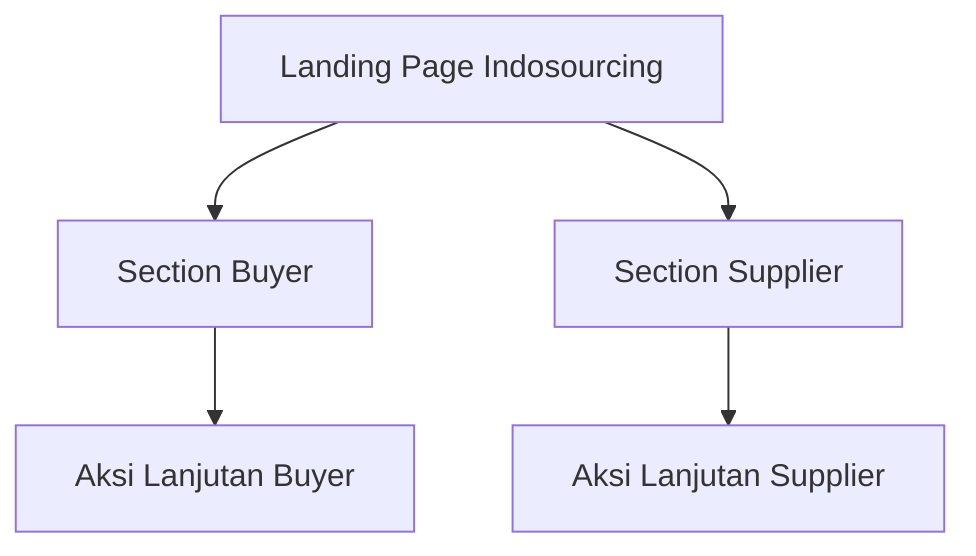

## 1. Product Overview
Landing page Indosourcing untuk menjelaskan value proposition dan mendorong konversi lead dari dua segmen: Buyer dan Supplier.
Fokus pada kejelasan layanan, trust, dan CTA yang mengarahkan pengunjung ke jalur yang tepat.

## 2. Core Features

### 2.1 User Roles
| Role | Registration Method | Core Permissions |
|------|---------------------|------------------|
| Pengunjung (Buyer) | Tidak ada (tanpa login) | Melihat informasi dan mengeksekusi CTA “Saya Buyer” |
| Pengunjung (Supplier) | Tidak ada (tanpa login) | Melihat informasi dan mengeksekusi CTA “Saya Supplier” |

### 2.2 Feature Module
1. **Landing Page Indosourcing**: header navigasi, hero + CTA Buyer/Supplier, ringkasan solusi, proses kerja, blok CTA per segmen, FAQ, footer.

### 2.3 Page Details
| Page Name | Module Name | Feature description |
|-----------|-------------|---------------------|
| Landing Page Indosourcing | Header & Navigation | Menampilkan logo, menu anchor (Solusi/Proses/Buyer/Supplier/FAQ), tombol CTA utama. |
| Landing Page Indosourcing | Hero (Above the fold) | Menjelaskan proposisi nilai singkat dan menampilkan 2 CTA primer: “Saya Buyer” dan “Saya Supplier”. |
| Landing Page Indosourcing | Value Proposition | Menjelaskan manfaat inti untuk sourcing (kualitas, efisiensi, kepercayaan) dalam 3–5 poin. |
| Landing Page Indosourcing | Social Proof / Trust | Menampilkan elemen kepercayaan (mis. angka ringkas/statement compliance/partner logo placeholder) untuk mengurangi keraguan. |
| Landing Page Indosourcing | Capability / Solution Overview | Menjelaskan ruang lingkup layanan/kapabilitas utama secara ringkas dalam kartu-kartu. |
| Landing Page Indosourcing | How It Works | Menjelaskan alur kerja Indosourcing dalam 3–5 langkah yang mudah dipindai. |
| Landing Page Indosourcing | Segmen: Buyer | Menyajikan pesan khusus buyer + CTA buyer (primary) yang mengarahkan ke tindakan lanjutan (mis. hubungi/submit inquiry). |
| Landing Page Indosourcing | Segmen: Supplier | Menyajikan pesan khusus supplier + CTA supplier (primary) yang mengarahkan ke tindakan lanjutan (mis. daftar/submit profile). |
| Landing Page Indosourcing | FAQ | Menjawab pertanyaan inti terkait cara kerja, area layanan, kualitas, dan waktu proses. |
| Landing Page Indosourcing | Footer | Menyediakan ringkasan navigasi, info kontak, dan legal singkat. |

## 3. Core Process
**Alur Buyer**: Kamu membuka landing page → membaca proposisi nilai → klik CTA “Saya Buyer” → masuk/scroll ke section Buyer → melakukan aksi lanjutan dari CTA buyer.

**Alur Supplier**: Kamu membuka landing page → membaca ringkasan kapabilitas → klik CTA “Saya Supplier” → masuk/scroll ke section Supplier → melakukan aksi lanjutan dari CTA supplier.

