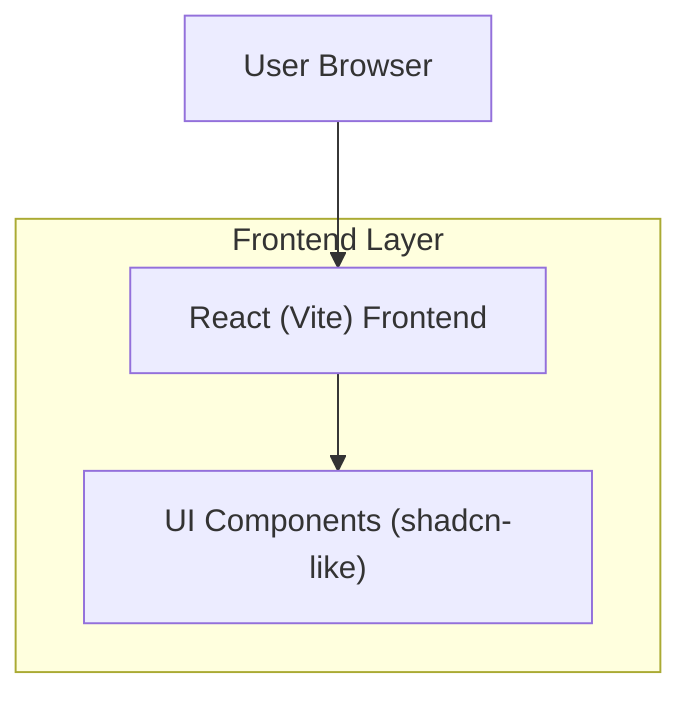

## 1.Architecture design

## 2.Technology Description
- Frontend: React@18 + TypeScript + vite + tailwindcss + shadcn/ui-style component system
- Backend: None

## 3.Route definitions
| Route | Purpose |
|-------|---------|
| / | Landing page utama dengan CTA Buyer/Supplier dan section berbasis anchor |
